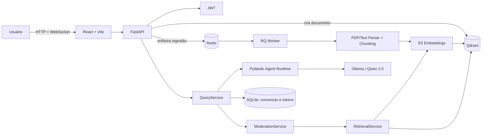
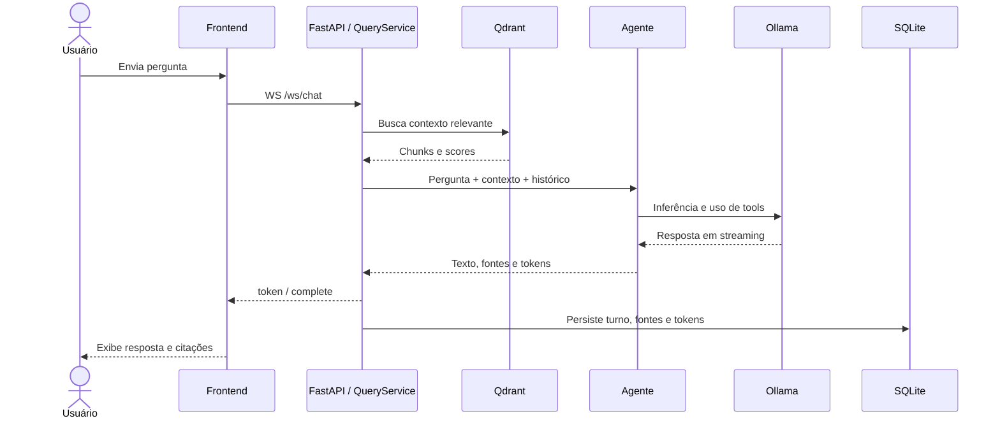
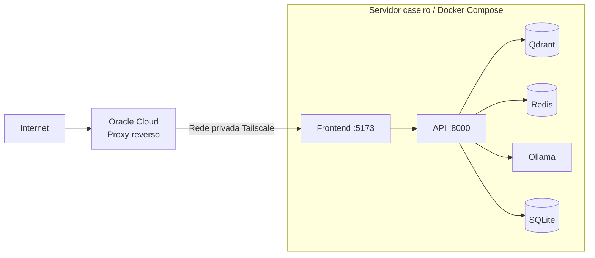

# AI Document Analyst

Aplicação RAG para importar PDFs/textos e responder perguntas com moderação, busca vetorial, agente e citações das fontes.

## Arquitetura



O backend segue arquitetura hexagonal: domínio e serviços centrais dependem de portas; FastAPI, Qdrant, Redis, SQLite, embeddings e Ollama ficam nos adapters.

## Fluxo de ingestão

1. O frontend envia um PDF ou texto para `POST /documents`.
2. A API cria o documento no Qdrant e envia o trabalho para o Redis.
3. O worker extrai o conteúdo, divide em chunks e gera embeddings E5.
4. Os chunks e vetores são gravados no Qdrant; o documento muda para `ready`.

## Fluxo de consulta



Perguntas sem contexto suficiente são recusadas pela moderação. Há um único fluxo canônico: `POST /query` e `WS /ws/chat`.

## Como executar

Requisitos: Docker e Docker Compose.

O `.env` é opcional porque há valores padrão, mas é recomendado:

```bash
cp .env.example .env
docker compose up -d --build
```

Na primeira execução são baixados o modelo do Ollama (aproximadamente 4,7 GB) e o modelo de embeddings; isso pode demorar alguns minutos.

### Onde abrir

| Serviço | Endereço |
|---|---|
| Aplicação | `http://localhost:5173` |
| API | `http://localhost:8000` |
| Swagger | `http://localhost:8000/docs` |
| Health check | `http://localhost:8000/health` |
| Qdrant | `http://localhost:6333` |
| Ollama | `http://localhost:11434` |

Login local padrão, quando não houver `.env`:

```text
usuário: admin
senha: change-this-password
```

Para ambientes expostos, altere obrigatoriamente `ADMIN_PASSWORD` e `JWT_SECRET`.

Comandos úteis:

```bash
docker compose ps
docker compose logs -f api worker ollama
docker compose down
```

Para apagar também documentos, modelos e histórico persistidos:

```bash
docker compose down -v
```

## Persistência

| Volume | Conteúdo |
|---|---|
| `qdrant_storage` | documentos, chunks e vetores |
| `conversations_db` | conversas, fontes e uso de tokens no SQLite |
| `ollama_data` | modelo LLM |
| `hf_cache` | modelo de embeddings |

## Deploy

O deploy deste projeto foi feito em um servidor caseiro. O tráfego público entra por um proxy reverso hospedado na Oracle e chega ao servidor por uma rede privada Tailscale. Assim, os serviços internos não precisam ficar diretamente expostos na internet.



Na topologia pública, apenas o proxy reverso deve receber tráfego externo. Qdrant, Redis, Ollama e SQLite permanecem restritos ao servidor/rede privada.

### Proteção de uploads

O `POST /documents` aplica estas defesas na API:

- rejeição antecipada por tamanho e contagem do corpo durante o streaming;
- limite padrão de arquivo de 20 MiB mais 64 KiB para o envelope multipart;
- PDF restrito a `application/pdf` e assinatura inicial `%PDF-`;
- até 10 uploads por usuário a cada 60 segundos, com contador no Redis;
- timeout padrão de 300 segundos para o job de ingestão no RQ.

Os valores podem ser ajustados no `.env` por `MAX_UPLOAD_SIZE_MB`, `UPLOAD_REQUEST_OVERHEAD_BYTES`, `DOCUMENT_UPLOAD_RATE_LIMIT`, `DOCUMENT_UPLOAD_RATE_WINDOW_SECONDS` e `INGESTION_JOB_TIMEOUT_SECONDS`.

O proxy reverso da Oracle deve cortar corpos grandes antes de eles atravessarem a Tailscale. Para Nginx, com o limite padrão da aplicação:

```nginx
location /documents {
    client_max_body_size 21m;
    proxy_pass http://servidor-tailscale:8000;
}
```

Se `MAX_UPLOAD_SIZE_MB` mudar, ajuste também `client_max_body_size`, deixando uma pequena margem para o envelope multipart. Essa barreira no proxy complementa a checagem da API e reduz tráfego e consumo no servidor caseiro.
